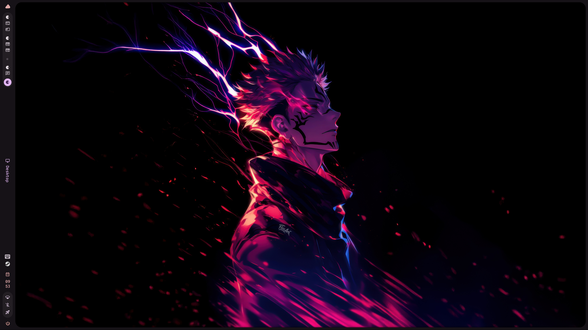
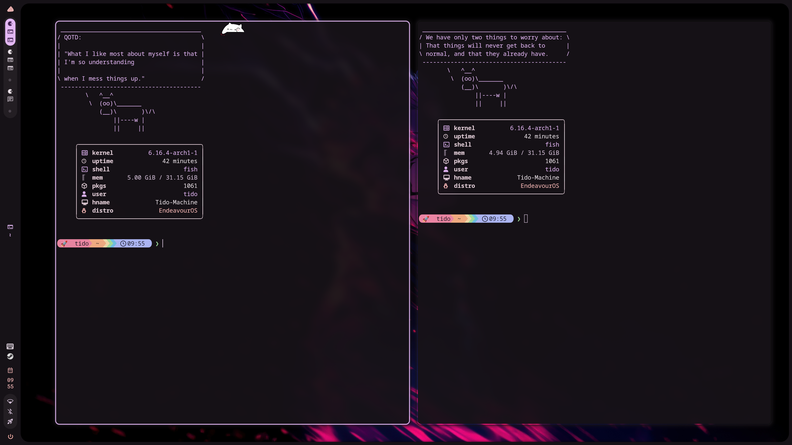
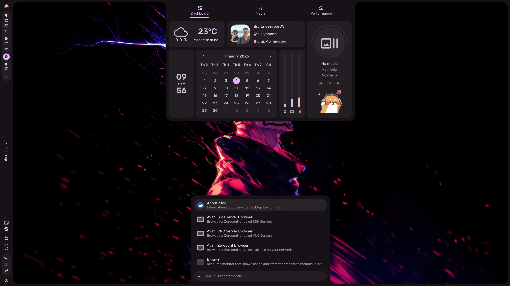
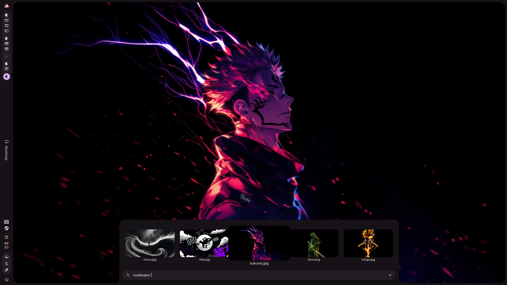

# 🌌 My Configs

This repository contains my personal configuration files for **Hyprland**, **Fish shell**, and other tools.  
I use it to keep my dotfiles organized and portable.    
---

## 📸 Screenshots

### 🖥️ Desktop

### 🐟 Fish Shell

### 🎨 Caelestia 

---

## 🙏 Credits & Inspiration

This setup is built on the shoulders of some amazing projects and their maintainers:  

- [**Caelestia Dots**](https://github.com/caelestia-dots/caelestia)  
  The creator of **Caelestia Shell**, which handles wallpaper management and theming in my setup.  

- [**Hyprland**](https://github.com/hyprwm/Hyprland)  
  A dynamic tiling Wayland compositor that provides the foundation of my desktop environment.  

- [**Fish Shell**](https://fishshell.com/)  
  A user-friendly and modern shell that powers my terminal experience.  

---

❤️ Huge thanks to these projects and their maintainers for their hard work and inspiration!  
